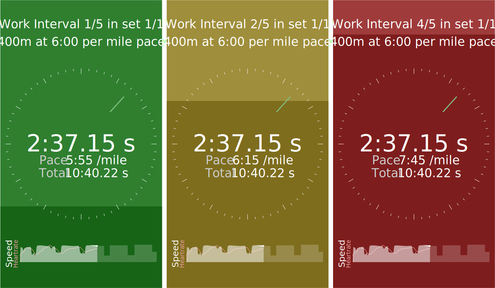

# MINTS - Mobile Intervals

## Data Processing

## UI

- Running view

  - Circular clock in the center with split time
  - Color in background for if you're on pace or not (Green, Yellow, Red)
  - Darkening Color rising to top for progress
  - Rest view Grey with darkening rising color to top
- Workout's View
  - Ad
  - Listing of old workouts
- Save Workout Modal
  - Suggested name?
- Setup view
  - Ad
  - Listing of Intervals w/ Rest
  - Interstitials
  - Warmup, Cooldown
  - Repeat of each "set"
- Settings view
  - Ad
  - Prefer Distance, Steps?
  - Connect heartrate

## Frameworks

- Bluetooth:
- GPS:
- Steps:
- Ads: [https://github.com/sbugert/react-native-admob](https://github.com/sbugert/react-native-admob)
